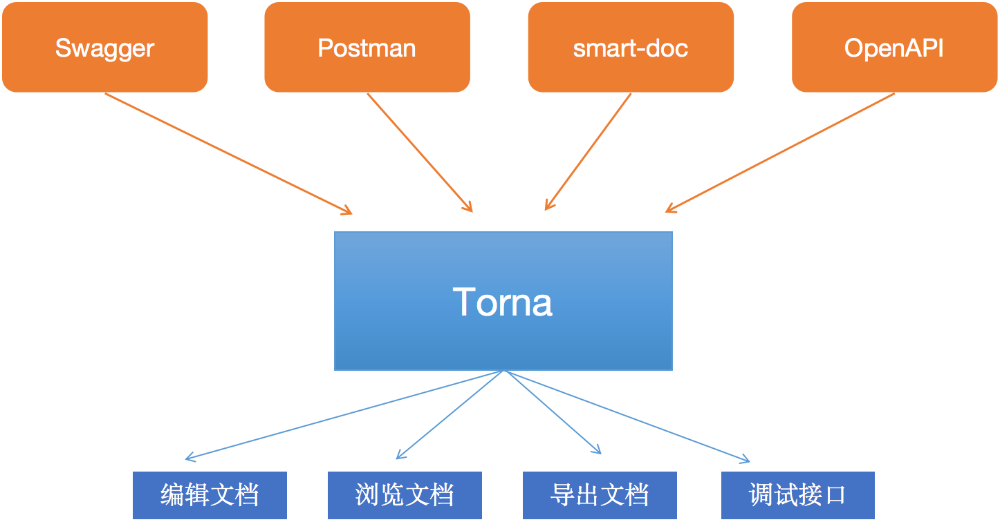
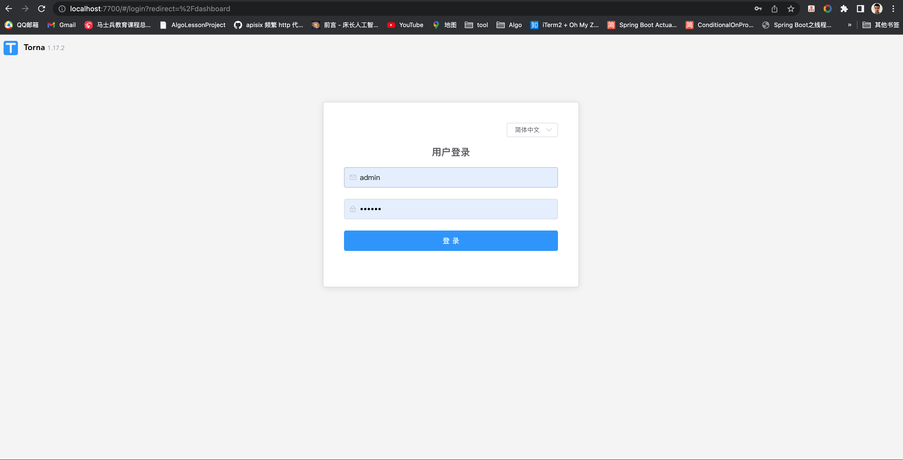

<h1 align="center"><a href="https://code.jsfund.cn/platform/client/component/amc/amc-doc" target="_blank">AMC API Doc Project</a></h1>

> 说明文档项目:
>
> [测试环境地址](https://10.0.195.163:6001) : https://10.0.195.163:6001
>
> [生产环境地址](https://doc.amc.jsfund.cn/api) : https://doc.amc.jsfund.cn/api

**AMC API Doc Project** 是一个同时支持您`接口文件上传`和`代码工具直传`的Java Rest API 和Apache Dubbo RPC API接口文档管理工具，是一个统一可以管理您接口文档的开源一站式解决方案。

**AMC API Doc Project** 整合了如下两种API管理与API生成的工具，在AMC平台内提供相关页面与接口对有文档使用需求的客户提供帮助！

## 项目概述

### 简介

项目是由如下三个构件组成：

`amc dashboard` [AMC平台提供者后台](http://10.0.195.163:7003) [提供能力上架,能力接口文档管理等]

`smart-doc` [一个开源文档生成工具](https://github.com/shalousun/smart-doc) [基于Java基本注释,生成接口文档]  

`torna`[一个开源文档管理工具](https://torna.cn/) [OpenAPI,文档管理,文档共享]                       

其中**Smart Doc** + **Torna** 使用较成熟的文档生成和管理解决方案，使用smart-doc无侵入完成Java 源代码和注释

             
Smart-Doc + Torna
 

### 解决文档管理痛点

- 不满足swagger文档预览页面和调试页面的展现方式
- 不喜欢swagger这种侵入式注解
- 希望使用javadoc注释生成文档，并进行接口调试
- 希望把公司所有项目接口文档进行统一管理
- 希望把项目中的若干文档提供给第三方调用者查看
- 希望可以统一管理项目中的字典枚举
- 如果您有以上几个需求和痛点，或许可以尝试一下使用Torna

## # 相关环境信息

### AMC Dashboard 能力提供方文档模块

> [AMC Dashboard测试环境地址](http://10.0.195.163:7003): http://10.0.195.163:7003
>
> [AMC Dashboard生产环境地址](http://dashboard.amc.jsfund.cn): http://dashboard.amc.jsfund.cn

             
AMC Dashboard能力提供方后台首页
 

创建能力卡片后

             
AMC Dashboard能力提供方后台能力编辑详情页
 

在接口文档模块您可以:`查看文档须知`、`获取文档空间token信息`、`同步预览已上传的文档链接`

### Torna API 管理网页后台

!> 测试环境文档网页地址:  请使用`域账号`登录，默认创建用户密码123456,首次登录需要修改密码

> [Torna API 管理后台测试环境](http://10.0.192.237:7700) : http://10.0.192.237:7700
>
> [Torna API 管理后台生产环境](http://torna.amc.jsfund.cn) : http://torna.amc.jsfund.cn

             
Torna API文档管理网页后台
 

