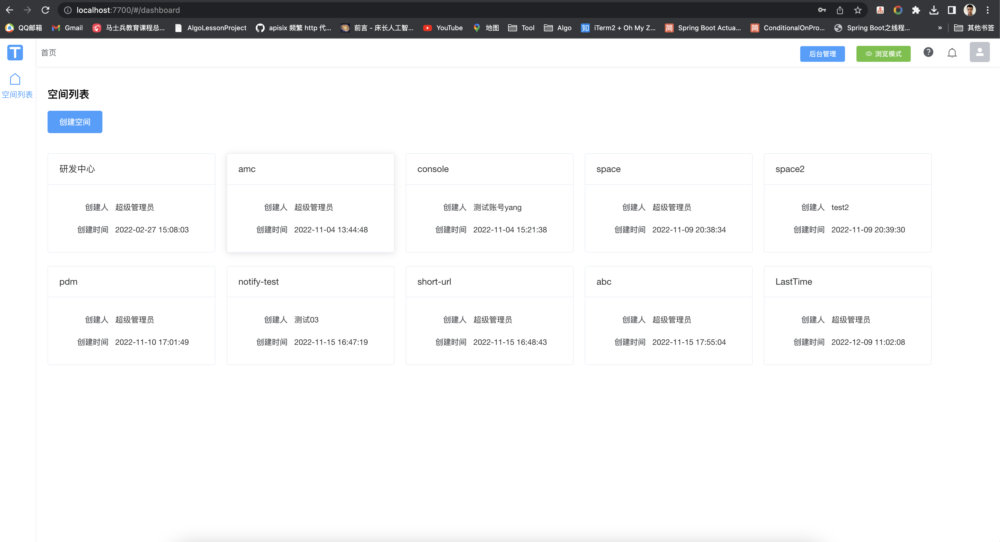
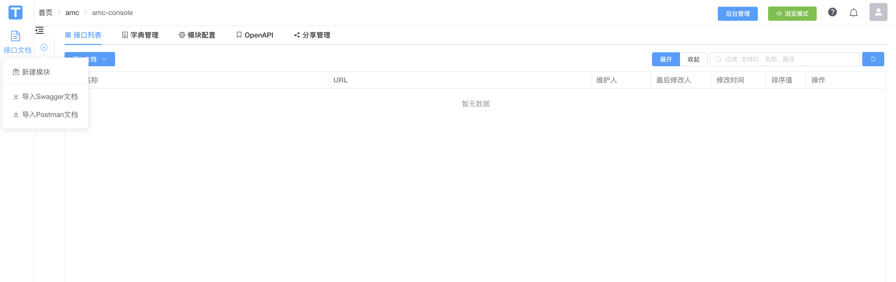
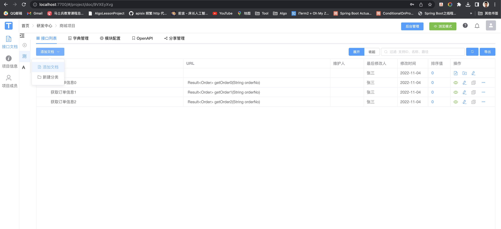
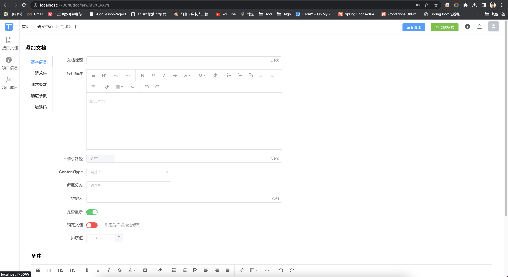
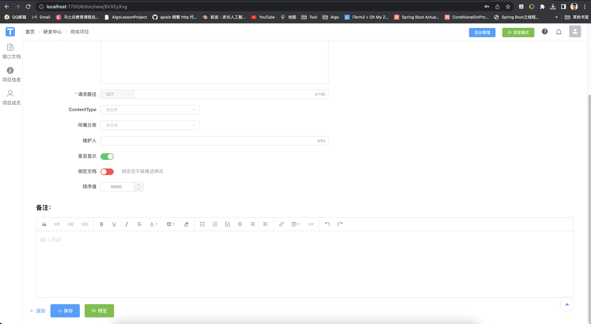

## 从Torna后台上传

### 方式1：页面上传Postman/Swagger格式文档

#### 登录后台,选择自己的项目空间

             
登录torna后台
 

#### 选择自己的模块,点击添加

             
导入swagger/导入postman
 

### 方式2：在页面自己写接口文档

             
模块选择添加文档
 

             
添加文档示例
 

             
添加文档示例
 
