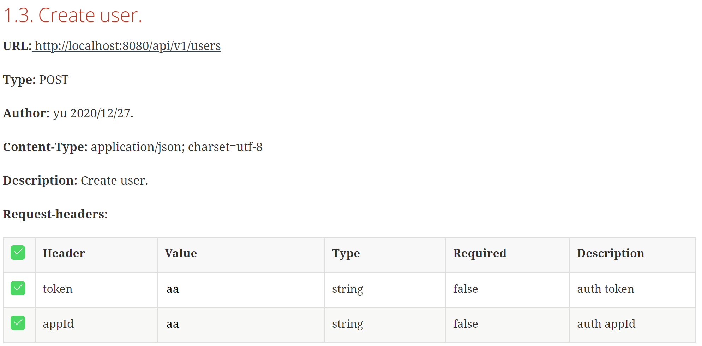
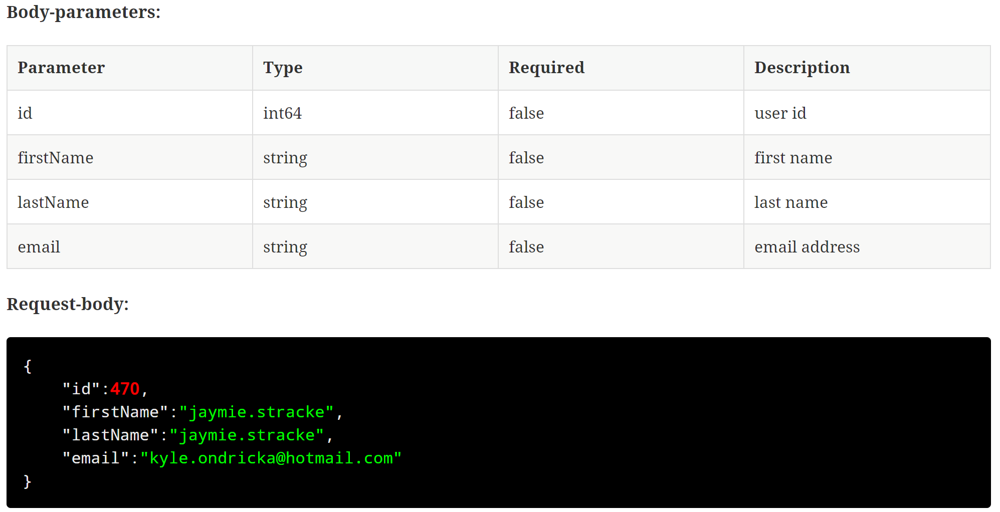
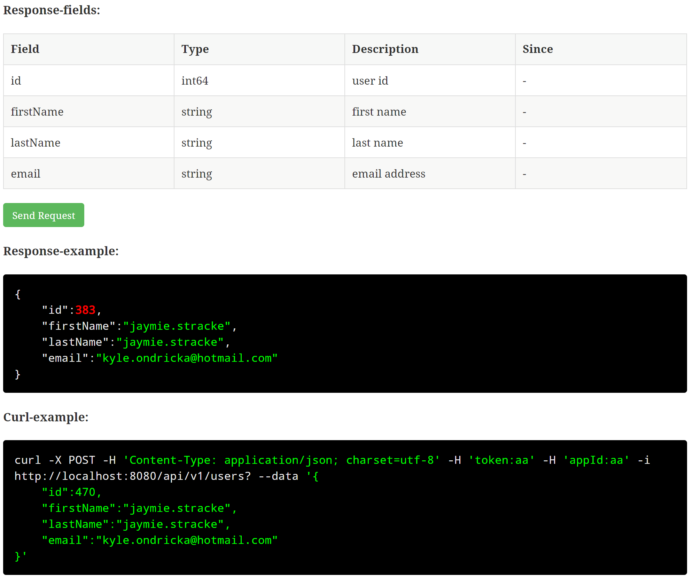
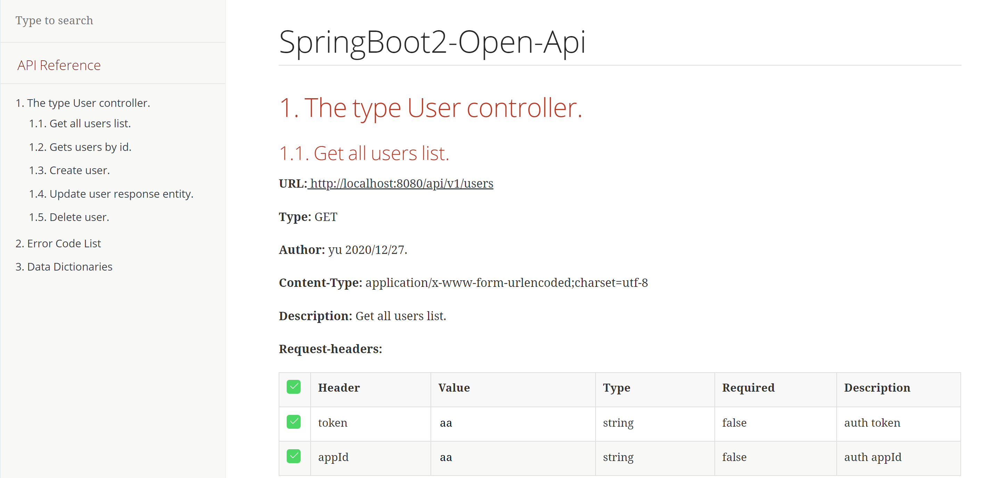
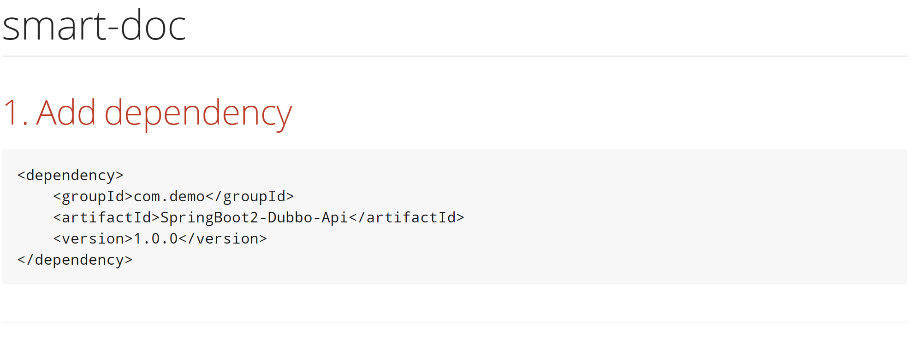
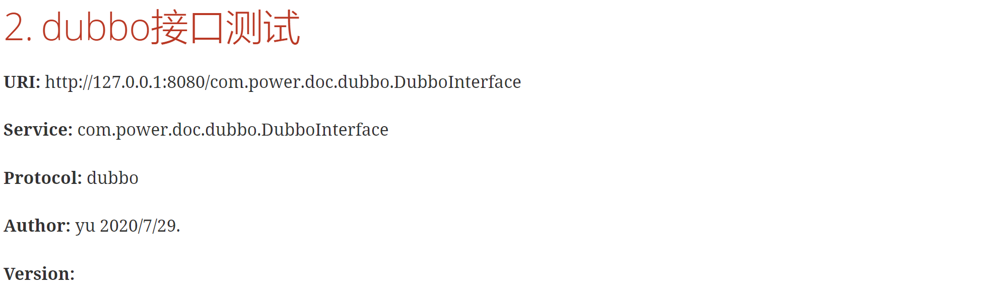
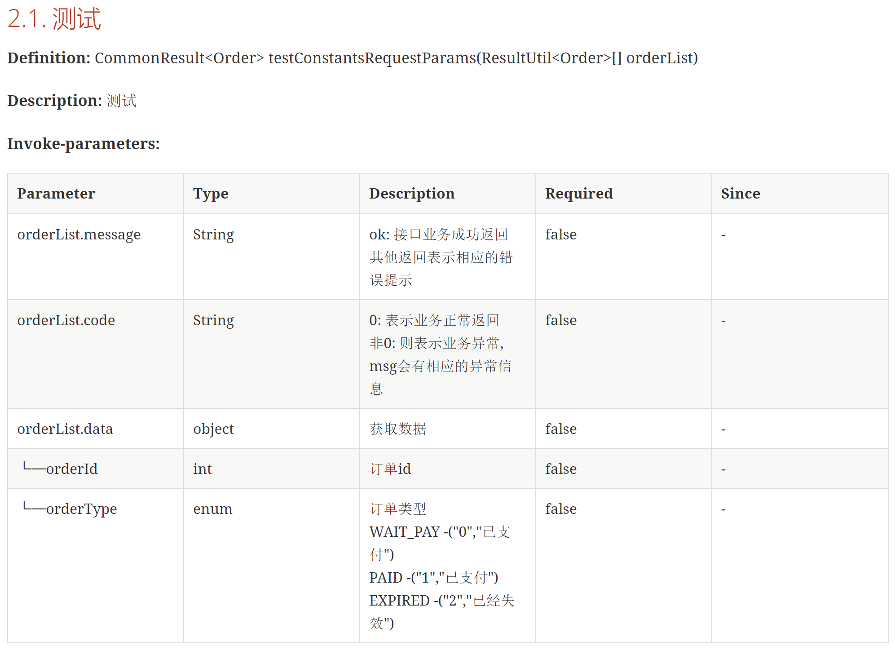
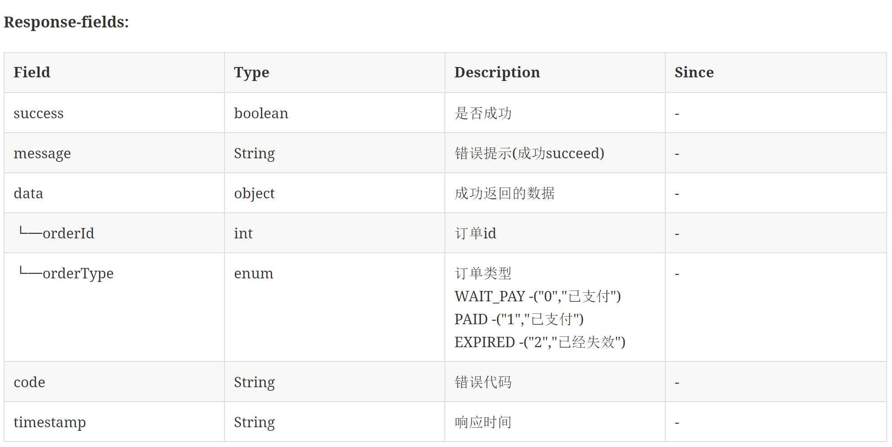
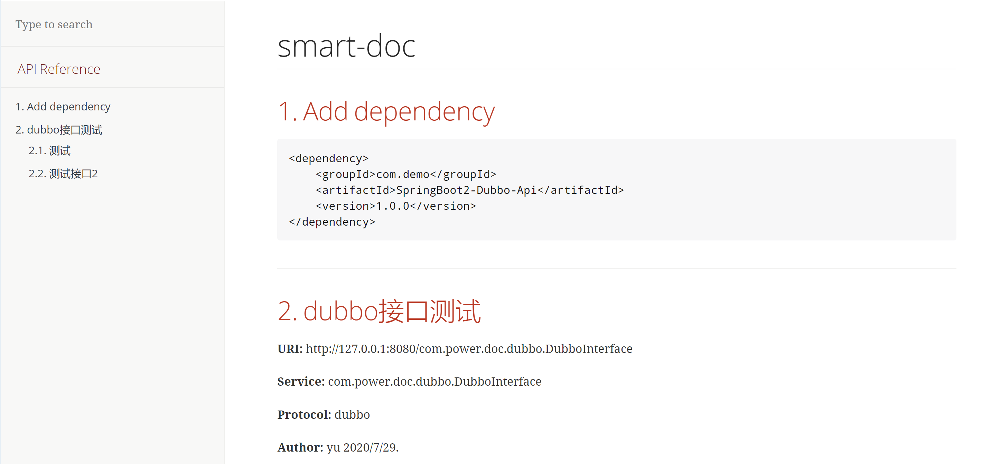

## Smart-doc生成文档效图

### Smart-doc接口文档效果图

  

### html全局效果

## Dubbo文档效果图

### dubbo接口文档效果图

   

### html格式dubbo全局文档

## 用户案例

下面是一些网友在开源项目中使用的smart-doc生成api文档的案例

- [豆瓣电影Plus](https://api.doubans.com/)