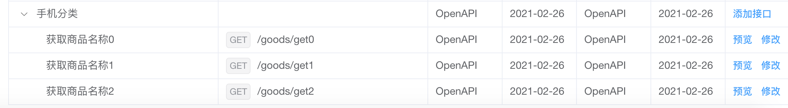
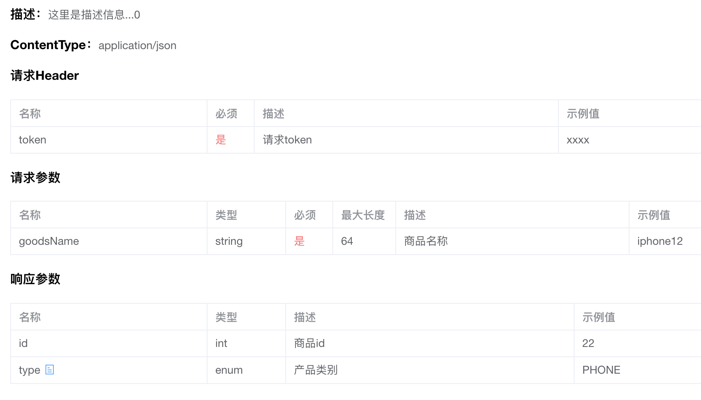

# OpenAPI

Torna面向开发者提供了OpenAPI能力，通过Torna服务提供的api接口，开发者可以把其它形式的文档推送到Torna服务，然后由Torna统一展示。

下面以`推送文档（doc.push）`接口讲解如何使用OpenAPI

通过`推送文档`接口，我们可以做以下几件事情：

- 指定调试环境
- 创建文档分类（文件夹），并在分类下创建多个文档
- 创建字典，将字典与参数关联
- 指定请求header
- 指定错误码

下面我们使用Torna提供的SDK来完成这些操作。

首先创建请求客户端：

```java
static String url = "http://localhost:7700/api";
static String token = "c16931fa6590483fb7a4e85340fcbfef";

static OpenClient client = new OpenClient(url);
```

客户端创建一个实例即可，构造函数中填相应的参数。

创建一个请求类：

```java
DocPushRequest request = new DocPushRequest(token);
```

然后创建一个分类（文件夹）

```java
DocItem folder = new DocItem();
folder.setIsFolder(Booleans.TRUE);
folder.setName("手机分类");
```

在分类下面创建三个文档：

```java
List<DocItem> items = new ArrayList<>(8);
// 创建三个文档
for (int i = 0; i < 3; i++) {
    DocItem docItem = buildDocItem(time, i);
    items.add(docItem);
}
// 分类下面有文档
folder.setItems(items);
```

`buildDocItem()`方法是最主要的方法，这里直接给出完整内容：

```java
private static DocItem buildDocItem(int i) {
    DocItem item = new DocItem();
    /* 设置基本信息 */
    item.setName("获取商品名称" + i);
    item.setDescription("这里是描述信息..." + i);
    item.setUrl("/goods/get" + i);
    item.setHttpMethod("GET");
    item.setContentType("application/json");
    item.setParentId("");
    item.setIsShow(Booleans.TRUE);

    /* 设置header */
    DocParamHeader header = new DocParamHeader();
    header.setName("token");
    header.setRequired(Booleans.TRUE);
    header.setDescription("请求token");
    header.setExample("xxxx");
    item.setHeaderParams(Arrays.asList(header));

    /* 设置请求参数 */
    DocParamReq paramCreateParamReq = new DocParamReq();
    paramCreateParamReq.setName("goodsName");
    paramCreateParamReq.setType("string");
    paramCreateParamReq.setDescription("商品名称");
    paramCreateParamReq.setExample("iphone12");
    paramCreateParamReq.setMaxLength("64");
    paramCreateParamReq.setRequired(Booleans.TRUE);
    paramCreateParamReq.setParentId("");
    item.setRequestParams(Arrays.asList(paramCreateParamReq));

    /* 设置返回参数 */
    DocParamResp paramCreateParamResp = new DocParamResp();
    // id参数
    paramCreateParamResp.setName("id");
    paramCreateParamResp.setType("int");
    paramCreateParamResp.setDescription("商品id");
    paramCreateParamResp.setExample("22");
    paramCreateParamResp.setParentId("");
    // 类型参数，关联字典
    DocParamResp paramCreateParamResp2 = new DocParamResp();
    paramCreateParamResp2.setName("type");
    paramCreateParamResp2.setType("enum");
    paramCreateParamResp2.setDescription("产品类别");
    paramCreateParamResp2.setExample("PHONE");
    paramCreateParamResp2.setParentId("");
    // 设置字典
    paramCreateParamResp2.setEnumInfo(getEnumInfoParam());
    item.setResponseParams(Arrays.asList(paramCreateParamResp, paramCreateParamResp2));

    /* 设置错误码 */
    DocParamCode code = new DocParamCode();
    code.setCode("10001");
    code.setMsg("token错误");
    code.setSolution("请传token");
    item.setErrorCodeParams(Arrays.asList(code));

    return item;
}

private static EnumInfoParam getEnumInfoParam() {
    EnumInfoParam enumInfoParam = new EnumInfoParam();
    enumInfoParam.setName("产品类别");
    EnumItemParam phone = new EnumItemParam();
    phone.setName("PHONE");
    phone.setType("byte");
    phone.setValue("1");
    phone.setDescription("手机");

    EnumItemParam book = new EnumItemParam();
    book.setName("BOOK");
    book.setType("byte");
    book.setValue("2");
    book.setDescription("图书");

    enumInfoParam.setItems(Arrays.asList(phone, book));
    return enumInfoParam;
}
```

接着指定调试环境

```java
// 创建调试环境
DebugEnv debugEnv = new DebugEnv("测试环境", "http://localhost:8090");
```

最后设置请求参数，并且发送请求：

```java
// 设置请求参数
request.setApis(Arrays.asList(folder));
request.setDebugEnvs(Arrays.asList(debugEnv));

// 发送请求
DocPushResponse response = client.execute(request);
if (response.isSuccess()) {
    System.out.println("请求成功");
} else {
    System.out.println("errorCode:" + response.getCode() + ",errorMsg:" + response.getMsg());
}
```

接口调用成功后，会在后台看到新建的文档。



点击预览，可以看到具体的参数信息



- 关联字典


## [#](https://torna.cn/dev/openapi.html#数组参数)数组参数

有时候参数是以数组形式接收的，如以下结构：

```json
{
    "name": "jim",
    "list": [{...},{...}]
}
```

SDK设置数组参数方式如下：

DocParamReq对象里面有个children字段，用来设置数组参数

```java
// 数组参数
DocParamReq paramCreateParamReq2 = new DocParamReq();
paramCreateParamReq2.setName("priceList");
paramCreateParamReq2.setType("array"); // 注意这里是array
paramCreateParamReq2.setDescription("价格");
paramCreateParamReq2.setRequired(Booleans.TRUE);
List<DocParamReq> children = buildChildren();
paramCreateParamReq2.setChildren(children); // 设置子参数
item.setRequestParams(Arrays.asList(paramCreateParamReq, paramCreateParamReq2));
```

`buildChildren()`函数如下

```java
private static List<DocParamReq> buildChildren() {
    List<DocParamReq> list = new ArrayList<>();
    for (int i = 0; i < 2; i++) {
        DocParamReq paramCreateParamReq2_child = new DocParamReq();
        paramCreateParamReq2_child.setName("price" + i);
        paramCreateParamReq2_child.setType("int");
        paramCreateParamReq2_child.setDescription("价格");
        paramCreateParamReq2_child.setExample("100");
        paramCreateParamReq2_child.setMaxLength("64");
        paramCreateParamReq2_child.setRequired(Booleans.TRUE);
        list.add(paramCreateParamReq2_child);
    }
    return list;
}
```

生成结果如下，多个一个数组参数


如果是对象参数，也是如此，将type改成object即可

paramCreateParamReq2.setType("object");

## [#](https://torna.cn/dev/openapi.html#完整代码)完整代码

见源码中的`cn.torna.sdk.DocPushTest`