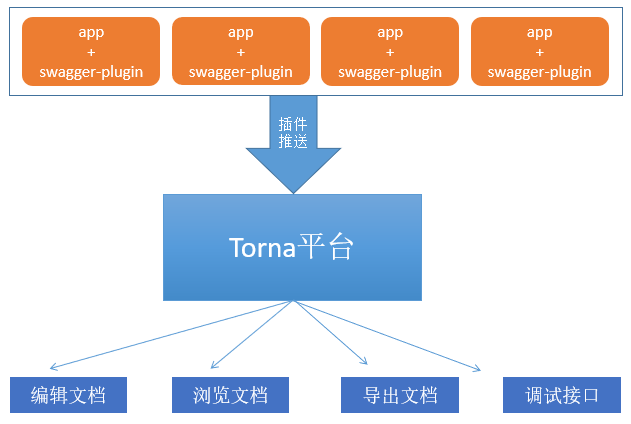
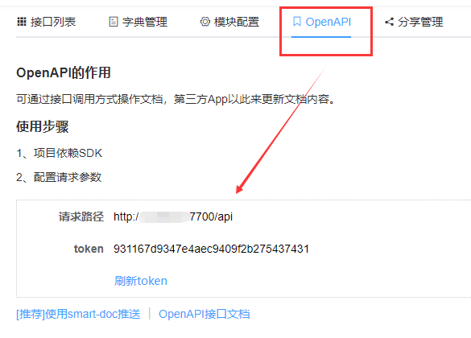

# Swagger插件

插件的作用是将本地项目中的Swagger文档内容推送到Torna平台，使用平台统一管理项目文档。



使用插件的好处有：

- 不用启动项目即可查看文档，调试接口
- 可区分多环境调试（开发环境、测试环境）
- 项目中只需要依赖`springfox-swagger2`即可，`springfox-swagger-ui`可以移除
- 可定义第三方jar中没有写注解的类

> 插件刚刚发布加上swagger注解使用多样化，并不能面面俱到，不足之处在所难免，如果疑问欢迎加Q群探讨：194673097

- [示例工程 (opens new window)](https://gitee.com/durcframework/torna-example)，演示swagger插件的用法

**使用步骤：**

1. 点击`项目列表`，创建一个项目，进入项目，创建一个模块
2. 点击创建好的模块，切换到`OpenAPI`选项卡，得到`url`，`token`



pom.xml添加依赖：

```xml
<dependency>
    <groupId>cn.torna</groupId>
    <artifactId>swagger-plugin</artifactId>
    <version>最新版本</version>
    <scope>test</scope>
</dependency>
```

`swagger-plugin`最新版本：

`src/main/resources`下添加一个`torna.json`文件，内容如下：

```json
{
  // 开启推送
  "enable": true,
  // 扫描package，多个用;隔开
  "basePackage": "cn.torna.tornaexample.controller",
  // 推送URL，IP端口对应Torna服务器
  "url": "http://localhost:7700/api",
  // 模块token
  "token": "931167d9347e4aec9409f2b275437431",
  // 调试环境，格式：环境名称,调试路径，多个用"|"隔开
  "debugEnv": "test,http://127.0.0.1:8088",
  // 推送人
  "author": "Jim",
  // 打开调试:true/false
  "debug": true,
  // 是否替换文档，true：替换，false：不替换（追加）。默认：true
  "isReplace": true
}
```

新增一个测试用例，内容如下：

```javascript
/**
 * 推送swagger文档
 */
public class DocPushTest {
    public static void main(String[] args) {
        SwaggerPlugin.pushDoc();
    }
}
```

运行main方法，插件会自动把swagger文档推送到Torna服务器。

## [#](https://torna.cn/dev/swagger-plugin.html#扫描特定的接口)扫描特定的接口

如果只想推送某一个controller中的接口，或者只想推送某一个接口，可在配置文件中添加如下配置：

```json
{
  ...
  "scanApis": [
    // 只推送UserController中的接口
    "com.xxx.UserController"
  ],
  ...        
}
```

scanApis是一个数组，可定义多个类，如果只想推送一个接口，填方法全名称即可：

```json
{
  ...
  "scanApis": [
    // 只推送UserController中的接口
    "com.xxx.UserController",
    // 指定方法全名称，推送某一个接口
    "com.xxx.OrderController.get"
  ],
  ...        
}
```

以上配置会推送`UserController中所有接口` + `OrderController.get接口`

TIP

IDEA可以右键方法 -> `Copy/Paste Special` -> `Copy Reference`快速复制方法全名称

## [#](https://torna.cn/dev/swagger-plugin.html#推送错误码)推送错误码

增加`"codes": [{...}, {...}]`节点定义错误码，格式如下：

```json
{
  ...
  "codes": [
    // 定义错误码
    {
      "name": "错误码", // 分组名称
      "description": "这里是全局错误码", // 错误码描述
      "itemType": "string", // 错误码类型
      "items": [ // 错误码列表
        { "value": "W_10001", "description": "参数错误" },
        { "value": "W_10002", "description": "缺少token" },
        { "value": 10000, "type": "number", "description": "缺少参数" } // 单独指定类型
      ]
    }
  ]
  ...        
}
```

此外还可以定义枚举类型：

```json
{
  // 定义枚举
  "codes": [
    // 定义枚举
    {
      "name": "订单状态枚举",
      "itemType": "number",
      "items": [
        { "name": "WAIT_PAY", "value": 0, "description": "未支付" },
        { "name": "HAS_PAY", "value": 1, "description": "已支付" },
        { "name": "CANCEL", "value": 2, "description": "取消支付" }
      ]
    },
    
  ]
}
```

codes节点全部参数如下：

```json
{
  "codes": [
    {
      "name": "枚举名称【必填】",
      "description": "描述【可选】",
      "itemType": "枚举类型【可选】",
      "items": [ // 枚举项，必填
        { "name": "名称【可选】，不填使用value", "type": "类型【可选】，不填使用itemType", "value": "值【必填】", "description": "描述【可选】" }
      ]
    }
  ]
}
```

## [#](https://torna.cn/dev/swagger-plugin.html#第三方类处理)第三方类处理

接口返回第三方类，但是没有写swagger注解，生成的文档没有描述、示例等信息，如`mybatis-plus`中的`Page<T>`类。

```java
@ApiOperation(value = "第三方类演示")
@PostMapping("query")
public Result<Page<OrderDetail>> query(@RequestBody OrderQuery query) {
    return Result.ok(new Page<>());
}
```

解决方法，在`torna.json`文件中定义一个`jarClass`节点，内容如下：

```json
  // 第三方jar中的class配置
  "jarClass": {
    // Page是第三方jar中的类，需要给类中的属性定义文档信息
    "com.baomidou.mybatisplus.extension.plugins.pagination.Page": {
      "records": { "value": "查询数据列表", "example": "" },
      "total": { "value": "总数", "example": "100" },
      "size": { "value": "页数", "example": "10" },
      "current": { "value": "当前页", "example": "1" },
      "countId": { "hidden": true },
      "orders": { "hidden": true }
    },
    "com.xxx.common.Result": {
        "code": { "value": "查询数据列表", "example": "100" },
        "data": { "value": "数据", "example": "" },
        "msg": { "value": "错误消息", "example": "xx" }
    }
  }
```

其中`key`为第三方类的全限定名，`value`是类中字段信息，各个属性值对应`@ApiParam`中的属性，相当于给`records`属性加了`@ApiParam`注解。

## [#](https://torna.cn/dev/swagger-plugin.html#多环境配置)多环境配置

默认查找resources下的`torna.json`，可复制一份，命名为`torna-test.json`，用来区分不同环境，然后参数传文件名称

```java
SwaggerPlugin.pushDoc("torna-test.json");
```

## [#](https://torna.cn/dev/swagger-plugin.html#指定object类型对象)指定object类型对象

在处理第三方json类时（如：`com.alibaba.fastjson.JSONObject`、`cn.hutool.json.JSONObject`）这些类中有具体的属性， 这些属性不应该显示出来，返回示例应该显示`{}`（空对象）

因此需要对这些类做特殊处理，在`torna.json`中新增如下节点进行配置：

```json
  "objectClassList": [
    "cn.hutool.json.JSONObject",
    "com.alibaba.fastjson.JSONObject"
  ]
```

配置完后，如果有这些类型的参数，返回示例都显示`{}`

## [#](https://torna.cn/dev/swagger-plugin.html#注解扩展使用)注解扩展使用

使用`@ApiOperation.extensions`的扩展属性用来配置其它信息

- 指定维护人

指定之后将会在文档页展示当前接口的维护人

```java
@ApiOperation(value = "获取产品", notes = "获取产品说明。。", extensions = {
    // 指定维护人，name固定为author
    @Extension(name = "author", properties = {
        // name：维护人姓名，value空，可以填一个或多个
        @ExtensionProperty(name = "Tom", value = ""),
        @ExtensionProperty(name = "Jim", value = ""),
    })
})
```

- 指定接口错误码

指定之后将会在文档页面定义该接口的错误码

```java
@ApiOperation(value = "获取产品", notes = "获取产品说明。。", extensions = {
    // 指定错误码，name固定为code
    @Extension(name = "code", properties = {
        @ExtensionProperty(name = "100001", value = "id错误"),
        @ExtensionProperty(name = "100002", value = "错误描述2"),
        @ExtensionProperty(name = "100003", value = "错误描述3")
    })
})
```

## [#](https://torna.cn/dev/swagger-plugin.html#格式化输出)格式化输出

```json
{
  // 调试输出json格式化
  "debugPrintFormat": true
}
```

指定后，推送的内容将会格式化输出

## [#](https://torna.cn/dev/swagger-plugin.html#优先使用-api-tags属性-1-2-16)优先使用@Api.tags属性（1.2.16）

插件默认使用@Api.value()属性进行分类，如果要使用@Api.tags属性进行分类，则添加如下配置：

```json
  // 优先使用@Api.tags属性
  // 详见：cn.torna.swaggerplugin.bean.PushFeature
  "features": ["USE_API_TAGS"]
```