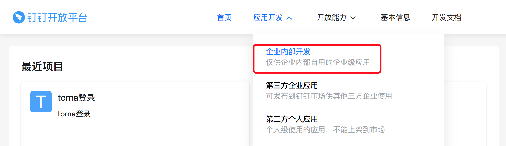

# 第三方登录

1.3.0开始支持第三方登录，并提供多种登录方式。

## [#](https://torna.cn/dev/third-party-login.html#ldap登录)LDAP登录

`application.properties`中添加配置：

```properties
# ldap服务器地址，如：ldap://172.16.6.64:389
torna.ldap.url=ldap://172.16.6.64:389
# ldap域名信息，如：dc=your_domain,dc=com
torna.ldap.base=dc=your_domain,dc=com
# 管理员账号，如：cn=Manager,dc=your_domain,dc=com
torna.ldap.username=cn=Manager,dc=your_domain,dc=com
# 管理员密码
torna.ldap.password=xxx
```

默认根据uid查询登录，如果要根据`sAMAccountName`登录，修改filter：

```properties
# 默认：(&(objectClass=*)(uid=%s))
torna.ldap.filter=(&(objectClass=*)(sAMAccountName=%s))
```

用户登录后会读取LDAP三种属性：

- uid：登录账号
- displayName：显示名称，这个会当做昵称，如果没有则uid当昵称

默认情况下LDAP用户登录没有设置邮箱，如果要设置邮箱，可以指定配置，设置邮箱域名：

```properties
torna.email-domain=xxx.com
```

然后用户邮箱会以`<uid>@xxx.com`的方式呈现

重启服务

## [#](https://torna.cn/dev/third-party-login.html#模拟表单登录)模拟表单登录

第三方服务提供一个登陆API，然后Torna服务调用这个登录API登录，登录成功后保存用户信息。

实现类：`cn.torna.service.login.form.impl.DefaultThirdPartyLoginManager`


开启步骤如下：

假设第三方登录接口如下：

- `POST` `http://a.abc.com/api/login`
- `Content-Type：application/json`
- 请求示例：

```json
{
    "username": "xx",
    "password": "xx"
}
```

- 返回示例：

```json
{
  "nickname": "Jim",
  "email": "jim@abc.com"
}
```

`application.properties`中添加配置：

```properties
# 开启第三方登录配置
torna.login.third-party.enable=true
# 登录类型，form，oauth 二选一，form：模拟表单登录，oauth：OAuth认证登录
torna.login.third-party.type=form
# 第三方登录url
torna.login.third-party.form.url=http://a.abc.com/api/login
# 登录账号参数名称
torna.login.third-party.form.key.param-username=username
# 登录密码参数名称
torna.login.third-party.form.key.param-password=password
# 返回结果昵称字段名称
torna.login.third-party.form.key.result-nickname=nickname
# 返回结果邮箱字段名称
torna.login.third-party.form.key.result-email=email
# 登录请求method
torna.login.third-party.form.method=POST
# 登录请求content-type
torna.login.third-party.form.content-type=application/json
```

返回结果中的昵称和邮箱选填，如果有建议返回，保证数据完整性。

配置完毕后，重启服务器，在登录页填写用户名密码。

如果返回结果带有状态码，如下面这个格式：

```json
{
    "status": 1000,
    "nickname": "Jim",
    "email": "jim@abc.com"
}
```

可在配置文件中添加如下配置：

```properties
# 返回code字段名称
torna.login.third-party.form.key.result-code=status
# 返回成功时，code值
torna.login.third-party.form.value.result-code=1000
```

如果返回结果带有状态码，消息，数据节点，如下面这个格式：

```json
{
   "code": "0",
   "msg": "",
   "data": {
      "nickname": "Jim",
      "email": "jim@abc.com"
   }
}
```

可在配置文件中添加如下配置：

```properties
# 返回code字段名称
torna.login.third-party.form.key.result-code=code
# 返回成功时，code值
torna.login.third-party.form.value.result-code=0
# 返回msg字段名称
torna.login.third-party.form.key.result-msg=msg
# 返回数据节点字段名称，没有指定则为根节点
torna.login.third-party.form.key.result-data=data
```

## [#](https://torna.cn/dev/third-party-login.html#gitlab账号登录-oauth认证)GitLab账号登录（OAuth认证）

OAuth的认证流程如下（详见：[OAuth认证 (opens new window)](https://tools.ietf.org/html/rfc6749#section-1.2)）：

```text
     +--------+                               +---------------+
     |        |--(A)- Authorization Request ->|   Resource    |
     |        |                               |     Owner     |
     |        |<-(B)-- Authorization Grant ---|               |
     |        |                               +---------------+
     |        |
     |        |                               +---------------+
     |        |--(C)-- Authorization Grant -->| Authorization |
     | Client |                               |     Server    |
     |        |<-(D)----- Access Token -------|               |
     |        |                               +---------------+
     |        |
     |        |                               +---------------+
     |        |--(E)----- Access Token ------>|    Resource   |
     |        |                               |     Server    |
     |        |<-(F)--- Protected Resource ---|               |
     +--------+                               +---------------+
```

这里以`GitLab`作为认证服务器讲解如何配置参数

- 前往GitLab设置页面，点击`Applications`，配置认证。


- Name：名称，随便取
- Redirect URI：回调地址，固定格式：`http://ip:port/system/oauth/custom/callback`，`ip`，`port`填Torna服务器对应IP端口
- Scopes：勾选图中两项

点击保存，出现配置信息，如下图所示：


然后在`application.properties`中添加配置：

```properties
# 开启第三方登录配置
torna.login.third-party.enable=true
# 登录类型，form，oauth 二选一，form：模拟表单登录，oauth：OAuth认证登录
torna.login.third-party.type=oauth
# 登录按钮文字，GitLab登录,如果value有中文需要转换成Unicode
torna.login.third-party.oauth.login-button-text=GitLab\u767b\u5f55
# 对应Application Id
torna.login.third-party.oauth.client-id=b29160dcb9f33334a599f180c34f3207c263dc5d9ee921dbe969e59836b61232
# 对应Secret
torna.login.third-party.oauth.client-secret=bc240d981fd5d3a04bde15c266af3373abf2664a948449b0d482a88267a4d51b
# 对应Callback url
torna.login.third-party.oauth.redirect-uri=http://10.1.30.165:7700/system/oauth/custom/callback
# 对应Scopes，用+相连
torna.login.third-party.oauth.scope=read_user+openid

# 下面是GitLab配置
# 授权的url，IP端口对应GitLab服务器
torna.login.third-party.oauth.url.authorize=http://10.211.55.5:7777/oauth/authorize
# 获取accessToken的url，IP端口对应GitLab服务器
torna.login.third-party.oauth.url.access-token=http://10.211.55.5:7777/oauth/token
# 获取用户信息的url，IP端口对应GitLab服务器
torna.login.third-party.oauth.url.user-info=http://10.211.55.5:7777/api/v4/user
```

配置完毕后，重启服务，访问登录页，点击下方的`第三方登录`，或者直接在浏览器输入：`http://ip:port/system/oauth/login/custom` IP端口对应Torna服务器


页面会跳转到GitLab登录页，输入GitLab账号，登录后会询问是否授权，点击授权，成功后跳转到Torna首页。


- 相关源码

见：`cn.torna.service.login.oauth包`

controller：`cn.torna.web.controller.system.OauthController`

Torna的OAuth认证基于 [JustAuth(opens new window)](https://gitee.com/yadong.zhang/JustAuth)

## [#](https://torna.cn/dev/third-party-login.html#钉钉免密登录)钉钉免密登录

使用场景：在钉钉工作台配置一个图标，点击图标立即跳转到Torna首页，免登录就能使用。


前提：公网能够访问你的Torna应用。

登录[钉钉开发者后台(opens new window)](https://open-dev.dingtalk.com/v2/#/index)



进入`应用开发` - `企业内部开发`，点击`创建应用`，创建一个创建企业内部应用，填写表单


钉钉图标：


创建成功后生成对应`AppKey`和`AppSecret`

点击`开发管理`，填写配置

- 服务器出口IP

填Torna服务出口IP

- 应用首页地址/PC端首页地址

两者一样，填`http://{domain}/system/dingtalk/login`，`domain`为你的公网域名，如：`http://torna.xxx.com/system/dingtalk/login` ，`http://torna.bbb.com:7700/system/dingtalk/login`

- 管理后台地址

不用填


保存

点击`权限管理`，开通相关接口权限。

需要开通的有：手机号码信息，邮箱等个人信息，成员信息读权限，调用OpenApp专有API时需要具备的权限

点击`钉钉登录与分享`，填写回调域名

填：`http://{domain}/system/dingtalk/callback`，`domain`为你的公网域名

点击`版本管理与发布`，发布应用。

- 配置`application.properties`

新增如下配置：

```properties
# 公网地址，到端口号，末尾没有/，如：http://torna.xxx.com，http://torna.xxx.com:7700
torna.base-url=http://torna.xxx.com
# 应用的AppKey
torna.dingtalk.app-key=应用的AppKey
# 应用的AppSecret
torna.dingtalk.app-secret=应用的AppSecret
```

重启服务器，到钉钉OA工作台，点击Torna图标进行登录


如果登录失败，打开服务端日志`log/server.log`查看报错信息，如果是IP白名单问题，将报错中的IP添加的出口IP中。