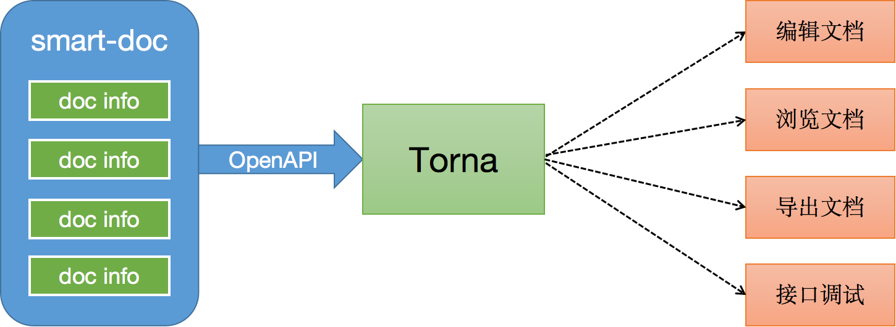
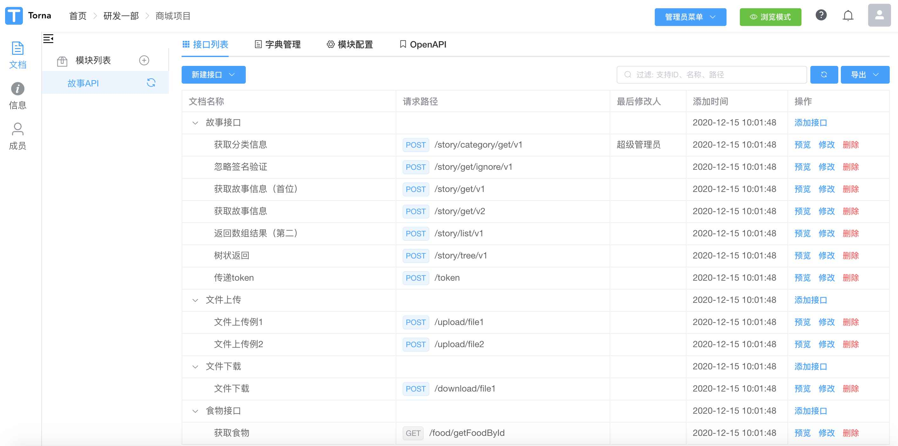
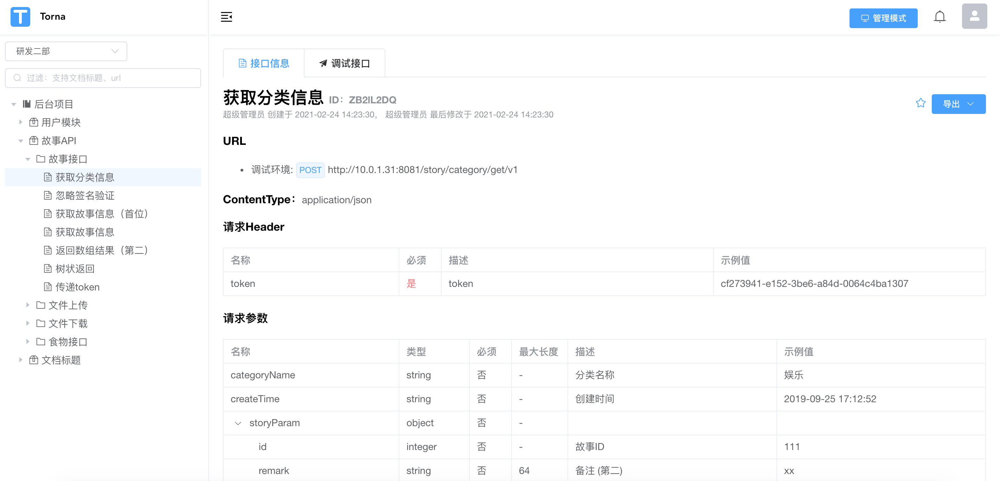
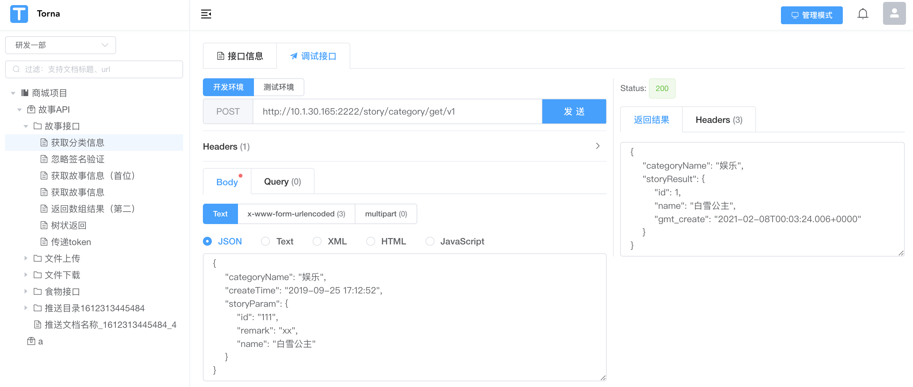
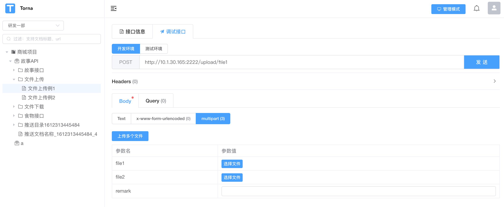

 

[Torna](https://torna.cn/)

[开发文档](https://torna.cn/dev/)

[源码 (opens new window)](https://gitee.com/durcframework/torna)

接口文档解决方案

##### 文档管理

支持接口文档增删改查、导入导出、OpenAPI接入、字典管理、接口调试

##### 权限管理

以项目组的形式管理接口，各项目组之间接口互不影响，同时有访客、开发者、管理员三种角色，每种角色有用不同权限

##### 双模式

提供【管理模式】、【浏览模式】双模式，管理模式用来编辑文档内容，浏览模式纯粹查阅文档，界面无其它元素干扰

##### [#](https://torna.cn/#解决文档管理痛点)解决文档管理痛点

- 不满足swagger文档预览页面和调试页面的展现方式
- 不喜欢swagger这种侵入式注解
- 希望使用javadoc注释生成文档，并进行接口调试
- 希望把公司所有项目接口文档进行统一管理
- 希望把项目中的若干文档提供给第三方调用者查看
- 希望可以统一管理项目中的字典枚举

如果您有以上几个需求和痛点，或许可以尝试一下使用Torna

##### [#](https://torna.cn/#推荐组合)推荐组合

**smart-doc + Torna实现文档全流程自动化**

如果您使用Java语言，推荐使用`smart-doc + Torna`

[Torna整合smart-doc教程(opens new window)](http://torna.cn/dev/smart-doc.html)

[smart-doc (opens new window)](https://gitee.com/smart-doc-team/smart-doc)+ Torna 组成行业领先的文档生成和管理解决方案，使用smart-doc无侵入完成Java源代码和注释提取生成API文档，自动将文档推送到Torna企业级接口文档管理平台。

通过这套组合您可以实现：只需要写完Java注释就能把接口信息推送到Torna平台，从而实现接口预览、接口调试。

如果您是非Java语言，可以使用表单页面编辑以上内容，完成后同样可以进行接口预览、调试。

##### [#](https://torna.cn/#界面预览)界面预览

##### [#](https://torna.cn/#文档管理)文档管理

##### [#](https://torna.cn/#文档编辑)文档编辑

##### [#](https://torna.cn/#文档预览)文档预览

##### [#](https://torna.cn/#接口调试)接口调试

##### [#](https://torna.cn/#上传文件)上传文件

