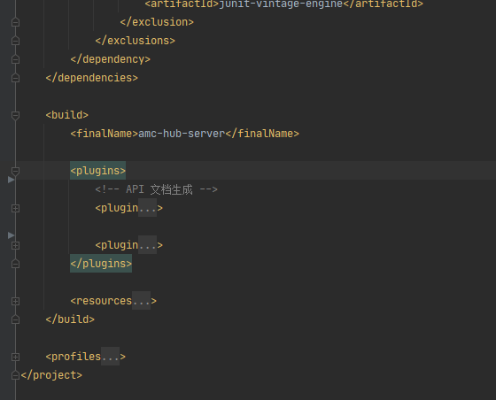
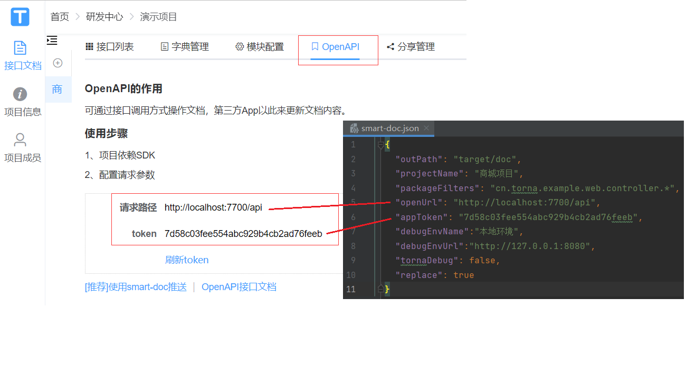

<h1 align="center"><a href="https://code.jsfund.cn/platform/client/component/amc/amc-doc" target="_blank">AMC API Doc Project</a></h1>

### 从代码上传

<center>        <br>    <div style="color:orange; border-bottom: 1px solid #d9d9d9;    display: inline-block;    color: #999;    padding: 2px;">文档流程</div> </center>

## 概述

1. 生成能力卡片，填写项目相关服务信息后，`获取API空间令牌`获取项目的API Doc Space Token（文档空间令牌）
2. `写API文档`（基于java注释规范）
3. `配置Maven插件` smart-doc-plugin pom.xml的插件
4. `配置基础参数` smart-doc.json 文档基础配置参数
5. `推送`(Maven插件或者后台上传) 文档，至Torna已生成的项目空间
6. `AMC Dashboard后台页面`点击同步与预览进行文档刷新即可

## 获取API空间令牌

在文档页面，您注册好自己的Provider应用组后，就会自动生成您的某一个Provider应用的`唯一文档空间`，如下图位置，会显示您的唯一API Doc Space Token

!> `API Doc Space Token` 是您上传您API文档的令牌，请妥善保管，或在管控仓内查看接口文档模块：`Token` 字段


```json
"Doc Space Token":"22klsdijflks-9837"
```

<center>        <br>    <div style="color:orange; border-bottom: 1px solid #d9d9d9;    display: inline-block;    color: #999;    padding: 2px;">Smart-Doc + Torna</div> </center>

## 写API接口注释

比如有一个接口定义如下：

```java
/**
 * 产品模块
 *
 * @author thc
 */
@RestController
@RequestMapping("shop/product")
public class ProductController {

    /**
     * 查询产品
     *
     * @param productNo 产品id|123
     * @return
     */
    @GetMapping
    public Result<ProductVO> get(@RequestParam Integer productNo) {
        ProductVO productVO = new ProductVO();
        productVO.setProductNo(String.valueOf(productNo));
        return Result.ok(productVO);
    }
}

public class ProductVO {
    /**
     * 产品id
     *
     * @mock aa
     */
    private String productNo;

    /**
     * 备注
     *
     * @mock xxx
     */
    private String remark;

    /**
     * 产品详情
     *
     * @mock
     */
    private ProductDetailVO productDetailVO;
    
    ... 省略getter setter   
}
```


## 配置

### 配置Maven插件

创建您的项目例如：Springboot工程，多模块形式，如下图目录结构，在接口模块中

```bash
your-project-name-dir  # 项目根目录 
├──shop-common       # 公共模块
├──shop-web          # 接口模块(springboot启动模块,内含启动类) 
├──pom.xml           # 根pom文件
└──readme.md
```

在`项目根`或者`API接口模块项目`中的`pom.xml` **添加** smart-doc Maven插件

?> 请参照如下xml，或直接复制到您的`pom.xml`。

`plugins`标签在`maven pom`的`build`的标签下。

```xml
<plugins>
    <!-- smart doc 插件：API文档生成 -->
    <plugin>
      <groupId>com.github.shalousun</groupId>
      <artifactId>smart-doc-maven-plugin</artifactId>
      <!--  推荐version 2.5.2 ${smart-doc.version}-->
      <version>2.5.2</version> 
      <configuration>
        <!--指定生成文档的使用的配置文件,配置文件放在自己的项目中-->
        <configFile>./src/main/resources/smart-doc.json</configFile>
        <!--指定项目名称,您项目的名称-->
        <projectName>${project.build.finalName}</projectName>
        <!--smart-doc实现自动分析依赖树加载第三方依赖的源码，如果一些框架依赖库加载不到导致报错，这时请使用excludes排除掉-->
        <excludes>
          <!--格式为：groupId:artifactId;参考如下-->
          <!--也可以支持正则式如：com.alibaba:.* -->
          <!--<exclude>com.alibaba:fastjson</exclude> -->
        </excludes>
        <!--includes配置用于配置加载外部依赖源码,配置后插件会按照配置项加载外部源代码而不是自动加载所有，因此使用时需要注意-->
        <!--smart-doc能自动分析依赖树加载所有依赖源码，原则上会影响文档构建效率，因此你可以使用includes来让插件加载你配置的组件-->
        <includes>
          <!--格式为：groupId:artifactId;参考如下-->
          <!--也可以支持正则式如：com.alibaba:.* -->
          <include>com.alibaba:fastjson</include>
          <!-- 如果配置了includes的情况下， 使用了mybatis-plus的分页需要include所使用的源码包 -->
          <include>com.baomidou:mybatis-plus-extension</include>
          <!-- 如果配置了includes的情况下， 使用了jpa的分页需要include所使用的源码包 -->
          <!--<include>org.springframework.data:spring-data-commons</include> -->
        </includes>
      </configuration>
      <executions>
        <execution>
          <!--如果不需要在执行编译时启动smart-doc，则将phase注释掉-->
          <phase>compile</phase>
          <goals>
            <!--smart-doc提供了html、openapi、markdown等goal，可按需配置-->
            <goal>html</goal>
          </goals>
        </execution>
      </executions>
    </plugin>
</plugins>
```

<center>        <br>    <div style="color:orange; border-bottom: 1px solid #d9d9d9;    display: inline-block;    color: #999;    padding: 2px;">build标签</div> </center>

### 验证Maven插件

> 两种方式：maven命令或idea maven 插件

##### 第一种 IDEA 插件

配置完上述maven 插件后，点击项目的clean install 同步，即可安装看到如下插件列表。

<center>        <br>    <div style="color:orange; border-bottom: 1px solid #d9d9d9;    display: inline-block;    color: #999;    padding: 2px;">Maven插件方式</div> </center>

##### 第二种 Maven命令

或在有smart-doc的目录下运行maven命令：

```bash
mvn -Dfile.encoding=UTF-8 smart-doc:torna-rest -pl :shop-web -am
```

其中`-pl :shop-web -am`表示推送哪个子模块


### 配置基础参数smart-doc文件

 在`shop-web` 您的<font color=red size=4>接口模块</font>中添加一个`smart-doc.json`文件，内容如下：<font color= red>请删除json中的注释，并替换相关参数</font>

[Smart-doc]: ../image/smart-doc.json	"模板文件"

[smart-doc.json 模板](../image/smart-doc.json)

[smart-doc-all.json 模板](../image/smart-doc.json)


```json
{
  "allInOne": true,
  "allInOneDocFileName":"index.html",
  "outPath": "./src/main/resources/static/doc",  
  "coverOld": true,
  "createDebugPage": true,
  "style":"xt256",
  "showAuthor":true,
  "requestFieldToUnderline":true,
  "responseFieldToUnderline":true,
  "displayActualType":true,
  "appToken": "3245e45cd29f4ef8a1f43a2126c47d9d", --这里是第一步获取文档内的Token -请替换成您的Token
  "isReplace":true,
  "openUrl": "http://10.0.192.237:7700/api",	    --嘉实测试环境文档推送接口地址  -请不要改动此项参数
  "debugEnvName":"shop-web测试环境",
  "debugEnvUrl":"http://10.0.192.184:7080"        --这里是我shop-web服务测试环境的服务地址 -请替换成您的测试环境
}
```

<center>        <br>    <div style="color:orange; border-bottom: 1px solid #d9d9d9;    display: inline-block;    color: #999;    padding: 2px;">对应关系图</div> </center>
