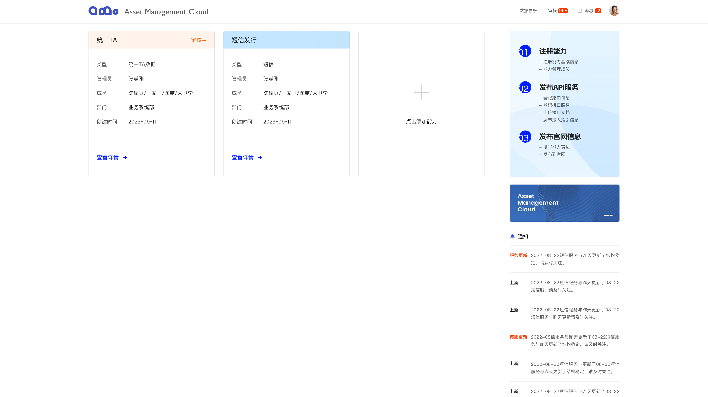
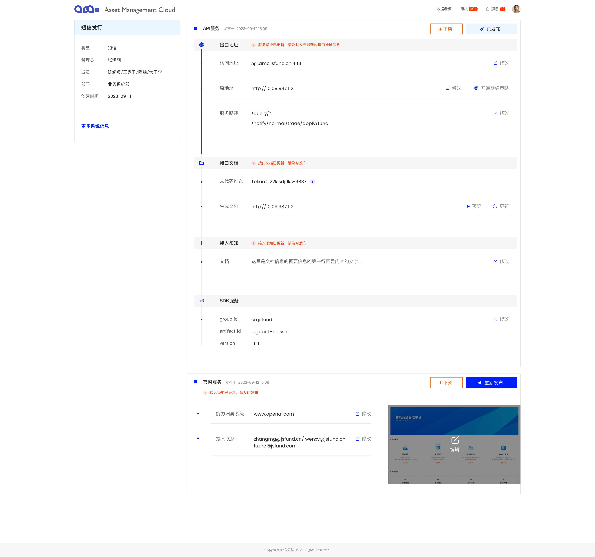
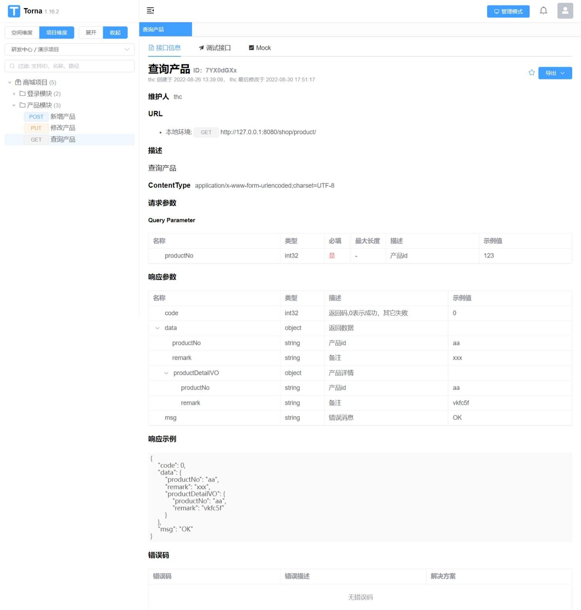

## 概述

两种方式

1. 通过`管控仓界面`查看`最后一次推送记录与文档信息`
2. 通过登录API文档管理后台自行查看

## 管控仓后台

点击`同步按钮`

?> 页面展示: 文档最后一次推送信息:推送日期，文档id等

             
卡片列表
 

             
卡片详情与文档模块信息
 

## API文档管理后台

!> 每一组Provider会默认生成一个文档空间。以及对应空间成员权限与账号。

?> 测试环境文档网页地址: 请使用`域账号`登录，默认创建用户密码123456,首次登录需要修改密码

> [相关环境信息](../README.md)

             
API文档管理后台
 
